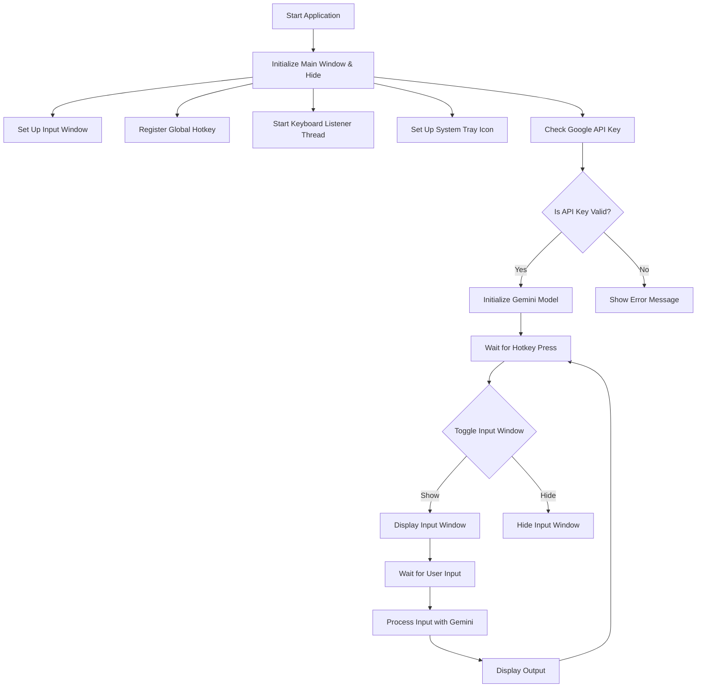

# File: `main.py`

## File Summary

### Overview
This Python file implements a desktop application called `QuickInputApp` that allows users to input text via a floating window triggered by a global hotkey. The app leverages Google's Generative AI (Gemini-2.0-flash-lite) to process and potentially "fix" the input text. The application runs in the background with a system tray icon for accessibility and uses threading to handle keyboard events and input window management.

### Main Components/Functions
1. **Initialization (`__init__`)**: Sets up the main window, input window, hotkey registration, and Google Generative AI configuration.
2. **Input Window Setup (`setup_input_window`)**: Creates a floating, rounded-corner window with a multi-line text input field.
3. **Keyboard Listener**: A separate thread listens for hotkey presses to toggle the input window visibility.
4. **System Tray Icon (`setup_tray_icon`)**: Adds a system tray icon for managing the app's visibility and exit options.
5. **Google Generative AI Integration**: Initializes the Gemini model using an API key from a local `api.key` file.

### Important Patterns/Dependencies
- **Dependencies**:
  - `keyboard`: For global hotkey detection.
  - `tkinter`: For GUI components (floating window, text input).
  - `pystray`: For system tray icon functionality.
  - `google.generativeai`: For text processing via Google's Gemini model.
  - `pyautogui`: For potential integration with screen automation.
  - `PIL`: For image handling (used in the system tray icon).
- **Patterns**:
  - **Singleton-like Behavior**: The app runs as a single instance with a hidden main window.
  - **Threading**: Keyboard events and input processing are handled in separate threads for responsiveness.
  - **Configuration Management**: The app reads the Google API key from a local file (`api.key`).

### Diagram (Flowchart for Business Logic)

This flowchart visualizes the app's startup, hotkey handling, input window management, and AI text processing. Arrows indicate the flow of logic, and decision points (diamonds) represent conditional checks.

## Table of Contents

- [class QuickInputApp (Lines 12-415)](#class-quickinputapp)

## Function Details

### class QuickInputApp (Lines 12-415)

# Comprehensive Analysis of `QuickInputApp` Code

The `QuickInputApp` is a Python application that provides a quick and user-friendly interface for text input and auto-correction using Google's Generative AI. Below is a detailed breakdown of the code:

---

## 1. **What It Does**

The application is a desktop utility that allows users to:
- **Show/Hide a Floating Input Window**: A small, draggable window with a text input field appears when a hotkey (`Ctrl+Alt+Space`) is pressed.
- **Submit Text**: Users can type text into the input field and submit it using `Ctrl+Enter`.
- **Auto-Correct and Auto-Type Text**: The submitted text is sent to Google's Generative AI (`gemini-2.0-flash-lite`) for improvement (e.g., grammar correction, professional rewriting). The corrected text is then auto-typed into the active application using `pyautogui`.
- **System Tray Integration**: The app runs in the background with a system tray icon, allowing users to start/stop the service, show the input field, or quit the app.
- **Hotkey Management**: A global hotkey is registered to toggle the input window, and it can be enabled/disabled via the system tray menu.
- **Rounded UI Design**: The input window features a modern, rounded design with transparency and draggable functionality.

---

## 2. **Parameters and Return Values**

### **Class Initialization (`__init__`)**
- **Parameters**: None
- **Return Value**: None
- Initializes the app's main variables, sets up the input window, registers the hotkey, starts a keyboard listener thread, and configures Google Generative AI.

### **Methods**
- **`setup_input_window()`**: Sets up the floating input window with a rounded design.
  - **Return Value**: None
- **`_create_rounded_rectangle()`**: Helper function to draw a rounded rectangle on a canvas.
  - **Parameters**:
    - `x1`, `y1`, `x2`, `y2`: Coordinates of the rectangle.
    - `radius`: Corner radius.
    - `**kwargs`: Additional canvas drawing options.
  - **Return Value**: ID of the created rounded rectangle.
- **`start_move()`, `stop_move()`, `do_move()`**: Handle window dragging functionality.
  - **Parameters**: `event` (mouse click or drag event).
  - **Return Value**: None
- **`setup_tray_icon()`**: Creates and displays the system tray icon with a menu.
  - **Return Value**: None
- **`register_hotkey()`**: Registers or unregisters the global hotkey based on service status.
  - **Return Value**: None
- **`start_service()`, `stop_service()`**: Starts or stops the service (hotkey functionality).
  - **Return Value**: None
- **`toggle_input_field()`**: Toggles the visibility of the input window.
  - **Return Value**: None
- **`show_input()`**: Shows the input window with a fade-in animation.
  - **Return Value**: None
- **`hide_input()`**: Hides the input window with a fade-out animation.
  - **Parameters**: `event` (optional, triggered by `Escape` key).
  - **Return Value**: None
- **`on_ctrl_enter_pressed()`**: Handles `Ctrl+Enter` keypress to submit text.
  - **Parameters**: `event` (keypress event).
  - **Return Value**: None
- **`auto_type_text()`**: Sends the input text to Google Generative AI for correction and auto-types the result.
  - **Return Value**: None
- **`keyboard_listener()`**: Thread function to listen for keyboard events.
  - **Return Value**: None
- **`quit_app()`**: Cleans up resources and exits the application.
  - **Return Value**: None
- **`run()`**: Runs the application’s main loop.
  - **Return Value**: None
- **`create_tray_icon_image()`**: Creates a custom icon for the system tray.
  - **Return Value**: `Image` object.

---

## 3. **Key Logic and Algorithms**

### **Hotkey Management**
- The `keyboard` library is used to register/unregister the `Ctrl+Alt+Space` hotkey. When pressed, the `toggle_input_field()` method is triggered to show/hide the input window.

### **Text Correction**
- The `auto_type_text()` method sends the input text to Google Generative AI with a specific prompt to improve the text. The corrected text is then extracted and auto-typed using `pyautogui`.

### **Window Dragging**
- The `start_move()`, `stop_move()`, and `do_move()` methods handle window dragging by tracking mouse movements and updating the window's position.

### **Fade Animation**
- The `show_input()` and `hide_input()` methods implement fade animations by gradually increasing/decreasing the window's transparency using the `-alpha` attribute.

### **System Tray Integration**
- The `pystray` library is used to create a system tray icon with a menu for controlling the app.

---

## 4. **Potential Edge Cases and Optimizations**

### **Edge Cases**
1. **Missing API Key**:
   - The app fails if the `api.key` file is missing or empty. A more graceful fallback (e.g., prompt for API key) could improve user experience.
2. **Google API Errors**:
   - If the API request fails (e.g., due to rate limits or invalid input), the error is displayed using a message box. Adding retries or a fallback mode could enhance robustness.
3. **Focus Handling**:
   - If the input window loses focus, users might need to manually click on it. Automatically focusing the window when shown could prevent this.
4. **Special Characters**:
   - The `pyautogui.write()` function might not handle all special characters correctly. Testing with a wider range of inputs is recommended.

### **Optimizations**
1. **Thread Management**:
   - The `keyboard_listener` thread continuously runs, which might consume unnecessary CPU. Using event-driven programming (e.g., `keyboard.on_press`) could be more efficient.
2. **Animation Smoothness**:
   - The fade animation uses fixed steps of 5%, which might not feel smooth on all systems. Dynamically adjusting the step size based on system performance could improve the experience.
3. **API Key Security**:
   - Storing the API key in a plain text file is insecure. Using environment variables or a secure vault like `keyring` would be better.
4. **Error Logging**:
   - Errors are printed to the console or shown in message boxes. Implementing a logging system (`logging` module) would provide better debugging capabilities.

---

